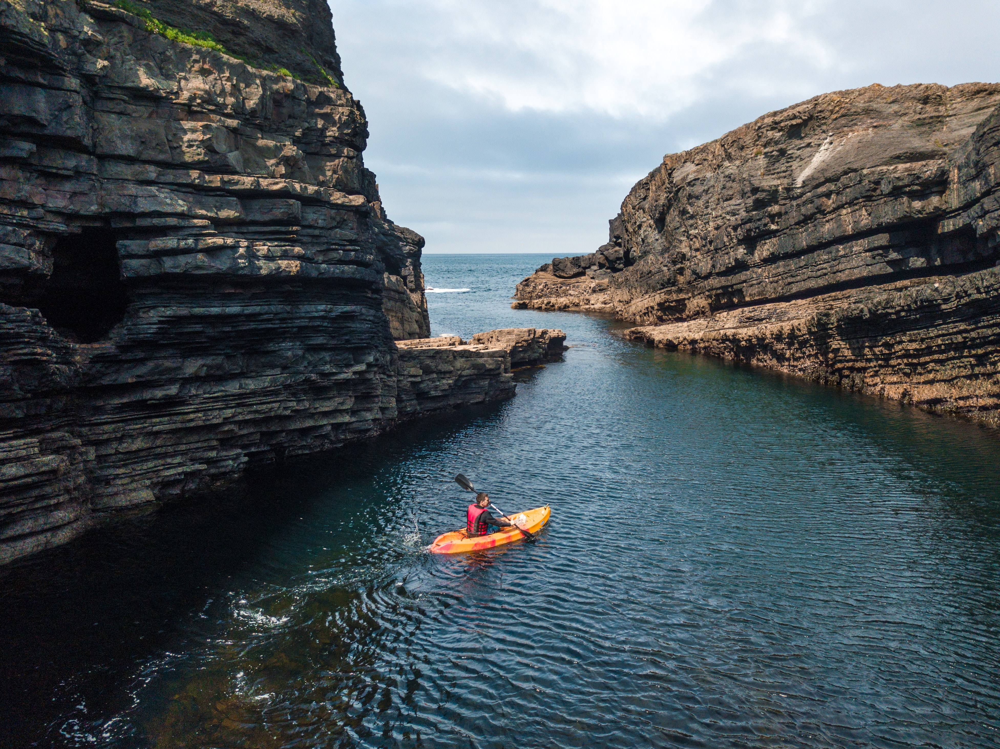

# Sand House - Gower Climbing Hut
This project aims to create a functional site for a fictional guesthouse on the Gower in South Wales and catering specifically to rock climbers. This is inspired by similar types of accommodation in southern Europe but that rarely exist in the UK. I think this gives scope to include a variety of different aspects and should provide an interesting visual aspect.

***

## UX

This site will primarily be aimed towards rock climbers looking to get away for a trip to enjoy their favourite passtime in the local area. The project aims to bring together an inspirational site that will make them excited to come to the Gower for a climbing trip and all the practical information they will need to book and ensure that their trip goes smoothly.   
The UX has largely been inspired by my own experiences with finding accommodation when orgaising climbing trips in Europe and everything I would expect to see on these sites. Some examples of these sites:
- [The Olive Branch, Spain](https://www.olivebranchelchorro.com/)
- [Nannai Climbing Home, Sardinia](https://www.climbingulassai.com/)
- [The Orange House, Spain](https://theorangehouse.co.uk/)  
  
The needs of the end user can be sumarised by the following User Stories:  

As a customer I want 
- an intuitive site that allows me to find all the information I need
- a site that works well on mobile devices so that I can browse on the go
- pictures of the accommodation so that I know exactly what it is like
- details of all the facilities that will be available for me to use
- clear information about prices so that I know exactly what it will cost
- details on policies and rules so that I know what is expected of me before and during my stay
- a contact form so that any questions I have can be answered
- a contact number so that I can always get in touch quickly and easily
- a map so that I can find the accommodation easily  

As part of the design process I drew up some wireframes to mock up the intended layout of the site, with different wireframes showing how the site would look over a variety of different device sizes. These wireframes can be seen [here](Wireframes/desktop-wireframes.pdf) for desktop layout, [here](Wireframes/tablet-wireframe.pdf) for tablet layout and [here](Wireframes/mobile-wireframes.pdf) for mobile device layout. Please note that for the tablet view there is only a wireframe for the home page as for the other pages the layout will be the same as wither the mobile or the desktop version.  
  
### Design Considerations

My colour palette found by using colormind.io - an online resourec that uses machine learning to identify colours that work well together. I uploaded a picture (I used my homepage hero image home-splash.jpg) to get suggested complementary colours and these colours are what I then used throughout my site (with the exception of my main logo for which I used a deeper sand colour). These colours match the local landscape and will be reminisent of what the customer will experience when they visit the local area.  
  
I used a variety of typefaces imported from GoogleFonts. I used cursive fonts Lobster and Lemonada for the logo, blurb and sub-headings to give a more casual feel reminisent of the atmosphere of the guesthouse. I used a popular sans-serif typeface Lato for the bulk of the text for easy legibility to convey the information effectively.

***

## Features

My project includes:
- A floating header/navigation bar that remains visible as the user scrolls down the page, allowing them to easily navigate through different parts of my site easily at all times.
- An embeded Google Map in the footer, making it easy for the customer to know exactly where we are located.
- Image carousels showcasing the different types of accommodation, allowing the user to see a large amount of photos of the room they are interested in without crowding out the page and making it unwieldy.
- A contact form allowing the customer to easily get in touch with the business.  
- A favicon so that the site is easily identifiable amongst many open tabs

### Features Left to Implement

Some features that could possibly be implemented in the future but that couldn't be included at this time:
- An availabillity calendar allowing customers to see exactly when any given accommodation is available to book.
- An integrated payments system allowing customers to book and pay for their stay in one visit to the page.

***

## Technologies Used

This project was constructed using [GitPod](https://www.gitpod.io/) IDE, with the repositry hosted on [GitHub](https://github.com/).  
  
The primary coding languages used were HTML5 (for the basic structure and content of the webpages), CSS3 (for the styling and layout of the webpages) and Markdown (for creating README.md and TESTING.md).  
  
Additional resources used:
- [Balsamiq Wireframes](https://balsamiq.com/wireframes/) - for creation of wireframes at start of project.
- [Google Fonts](https://fonts.google.com/) - for using custom typefaces throughout my project.
- [FontAwesome](https://fontawesome.com/) - for use of custom icons in accommodation.html and logos for social media links in my footers.
- [Bootstrap](https://getbootstrap.com/) - for including image carousels in accommodation.html.
- [Google Maps](https://www.google.com/maps/) - for including an embedded map in the footer.
- [Bitly](https://bitly.com/) - to shorten the URL for the embedded GoogleMaps in the footer.
- [Google Chrome DevTools](https://developer.chrome.com/docs/devtools/) - to visually analyse and temporarily edit code that was still in progress.
- [Colormind](http://colormind.io/) - to help in choosing a colour palette for the project.
- [Optimizilla](https://imagecompressor.com/) - to compress images for better performance
- [W3 HTML Validator](https://validator.w3.org/nu/) - to verify HTML code and check for errors
- [W3 CSS Validator](https://jigsaw.w3.org/css-validator/) - to verify CSS code and check for errors

***

## Testing

### Bugs

- When styled the contact form on contact.html is completely unresponsive - you are unable to select any of the input elements. When coding out the link to the CSS stylesheet the form works as expected. I adjusted z-index values to ensure that the form was sat on top of any other elements but that did not solve the problem. (potential problem with it being nested inside splash image?)  
Fixed by removing form container from within splash image container - as positioned absolute will make very little difference 
  
        <section>
            <div id="contact-splash">
                <div id="form-container">
                    <h3>Contact Us</h3> 
                    <form action="https://formdump.codeinstitute.net" method="post">
                    ...
                    </form>
                </div>
            </div>
        </section>

And replaced with...  
  
        <section>
            <div id="contact-splash">
            </div>
            <div id="form-container">
                <h3>Contact Us</h3> 
                <form action="https://formdump.codeinstitute.net" method="post">
                ...
                </form>
            </div>
        </section>


- The hover pseudo element on the form submit button is also not working as expected but I suspect that this is related to the problem with the form as a whole.
- The div id="other-ativities-text" in the other activities section in activities.html extends past the bottom of its parent container when the viewport is narrowed and as such pushes elements in the footer out of alignment  
  
  Initial code  
```    
    <section>
        <div id="other-activities">
            <h3>Other activities</h3>
            <div id="other-activities-img">
                
            </div>
            <div id="other-activities-text">
                <p>
                    The Gower is not just a hotspot for climbers, it also offers so much for all kinds of outdoor enthusiats! When you are done climbing why not try something else that is on offer:
                </p>
                <ul id="other-activities-list">
                    <li>Surfing - long sandy beaches provide some of the best surfing spots in the UK.</li>
                    <li>Kayaking - why not go exploring the many coves and secluded beaches around the Gower coast?</li>
                    <li>Walking - the Wales coastal path goes the full way around Gower taking in every bit of scenery.</li>
                </ul>
                <p>
                    Fancy trying something new? Why not pay our friends at <a href="https://www.goweradventures.co.uk/" target="_blank">Gower Adventures</a> a visit?
                </p>
            </div>
        </div>
    </section>
```
  
```
    #other-activities-text {
        width: 65%;
        display: inline-block;
        float: right;
    }
```  
  
CSS replaced with:  
```
    #other-activities-text {
    width: 65%;
    display: inline-block;
    vertical-align: top;
}

#other-activities-text p,
#other-activities-text ul {
    text-align: left;
}
```

Removed float value. Aligned text of children elements to left. Text now hugs image so will have to use margins/padding to give space between the two


- Hero image on index.html not showing when viewed on mobile device Potrait view) or heavily distorted (landscape view) - (look at keyframe animation?)
- Image captions on image carousel not showing when viewed on mobile device
- Rounded corners on carousel images are being cut off when screen width narrows. Also include border radius on parent .carousel-item divs to effectively round the corners on the window. Border radius should remain on img elements so that images smaller than the carousel window still retain their rounded corners.
- Map on accommodation.html is picking up Bootstrap styles which are affecting its positioning
- Contact form extends off screen when viewed in landscape mode (look at use of vh units when sizing splash image - change to px instead to match size of contact form)

        #contact-splash {
            width: 100%;
            height: 100vh;
            background: url("../Images/contact-splash.jpg") no-repeat center center;
            z-index: -10;
            position: relative;
            background-size: cover;
        }
      
And replaced with:
      
        #contact-splash {
            width: 100%;
            height: 775px;
            background: url("../Images/contact-splash.jpg") no-repeat center center;
            z-index: -10;
            position: relative;
            background-size: cover;
        }


***

## Deployment

The project is hosted on GitHub Pages and can be viewed [here](https://jgriffiths47.github.io/MS1-GowerClimbingHut/).  
  
The project files were hosted in a GitHub repositry. From that repositry I navigated to Settings>Pages in which I had to identify the branch of my depositry from which I wished to create the page (this would be the master branch, the only branch I have been working on for this project). I also then had to identify the directory folder the project should be run from, ie the folder in which my index.html homepage file is located. This was in teh root folder of teh directory - due to the relative small number of files in this project I did not create a docs directory to host my html files - this is something I may do for future larger projects. There were options to apply a theme to my .md files and to create a custom domain, both of which I ignored as I didn't think they would bring much value to the project. On clicking save the URL was displayed and the site was live (it took about 15 minutes to be viewable via the URL).  
  
I chose to deploy the project before it was finished so that I could share the URL and engage in more thorough testing at an earlier stage and to ensure that the output of the live site would match what was being displayed on the working previews I was working with on GitPod.

***How to clone and run project locally***

***

## Credits

### Media

All images were sourced from Unsplash whose licence allows free use of all photos available on their site. Details of the licence can be viewed [here](https://unsplash.com/license). Individual owners of the images used:
- accommodation-splash.jpg - Megan Andrews
- activities-splash.jpg - Brook Anderson
- camp1.jpg - Daan Weijers
- camp2.jpg - Patrick Hendry
- camp3.jpg - Zhang Kenny
- contact-splash.jpg - Josh Beech
- dorm1.jpg - Markus Winkler
- dorm2.jpg - Marcus Loke
- dorm3.jpg - Andrea Davis
- home-splash.jpg - Steve Bruce
- other-activities.jpg - Conor Luddy
- page-link-accommodation.jpg - Christopher Jolly
- page-link-activities.jpg - Cade Prior
- page-link-contact.jpg - Christin Hume
- private-room1.jpg - Andrea Davis
- private-room2.jpg - Blake Woolwine
- private-room3 - HausPhotoMedia
- review-profile-f.jpg - Jonas Verstuyft
- review-profile-m - Juan Goyache
- sport-climbing.jpg - Kevin Erdvig
- trad-climbing.jpg - Patrick Hendry

### Code

- The code used to justify the individual items on index.html and keep them responsive across the full range of device widths was adapted from code available at [css-tricks.com](https://css-tricks.com/equidistant-objects-with-css/). The code used can be seen in style.css lines !!!!!!!!!!!!!140 - 151!!!!!!!!!!!!!
- The code used to create photo carousels on accommodation.html was taken from [Bootstrap](https://getbootstrap.com/docs/4.5/components/carousel/#with-captions)
- The code used to put an icon in the browser tab was taken from [Digital Ocean](https://www.digitalocean.com/community/tutorials/how-to-add-a-favicon-to-your-website-with-html)