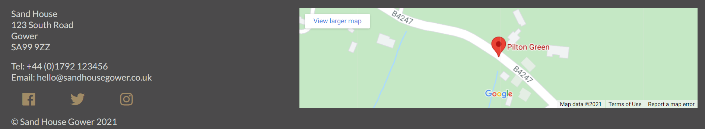

# Sand House - Gower Climbing Hut
This project aims to create a functional site for a fictional guesthouse on the Gower in South Wales and catering specifically to rock climbers. This is inspired by similar types of accommodation in southern Europe but that rarely exist in the UK. I think this gives scope to include a variety of different aspects and should provide an interesting visual aspect.

***

## UX

This site will primarily be aimed towards rock climbers looking to get away for a trip to enjoy their favourite passtime in the local area. The project aims to bring together an inspirational site that will make them excited to come to the Gower for a climbing trip and all the practical information they will need to book and ensure that their trip goes smoothly.   
The UX has largely been inspired by my own experiences with finding accommodation when orgaising climbing trips in Europe and everything I would expect to see on these sites. Some examples of these sites:
- [The Olive Branch, Spain](https://www.olivebranchelchorro.com/)
- [Nannai Climbing Home, Sardinia](https://www.climbingulassai.com/)
- [The Orange House, Spain](https://theorangehouse.co.uk/)  
  
The needs of the end user can be sumarised by the following User Stories:  

As a customer I want 
- an intuitive site that allows me to find all the information I need
- a site that works well on mobile devices so that I can browse on the go
- pictures of the accommodation so that I know exactly what it is like
- details of all the facilities that will be available for me to use
- clear information about prices so that I know exactly what it will cost
- details on policies and rules so that I know what is expected of me before and during my stay
- a contact form so that any questions I have can be answered
- a contact number so that I can always get in touch quickly and easily
- a map so that I can find the accommodation easily  

As part of the design process I drew up some wireframes to mock up the intended layout of the site, with different wireframes showing how the site would look over a variety of different device sizes. These wireframes can be seen [here](readme-assets/wireframes/desktop-wireframes.pdf) for desktop layout, [here](readme-assets/wireframes/tablet-wireframe.pdf) for tablet layout and [here](readme-assets/wireframes/mobile-wireframes.pdf) for mobile device layout. Please note that for the tablet view there is only a wireframe for the home page as for the other pages the layout will be the same as wither the mobile or the desktop version.  

While developing, the final layout evolved slightly from what was planned in the wireframes. I decided to move the introductory sections below the splash images on activities.html and accomomdation.html to allow the splash image to have a greater impact and also to be more consistent with the layout on index.html. I also decided to not include an embedded video nor a picture for teh other activities section in activities.html so as not to crowd the page with media.

### Design Considerations

My colour palette found by using colormind.io - an online resource that uses machine learning to identify colours that work well together. I uploaded a picture (I used my homepage hero image home-splash.jpg) to get suggested complementary colours and then chose my colours from these suggestions - editing one of the colours to give a deeper sand colour. The colour scheme largely uses greys reminiscent of teh local rock with a touch of sand colour relating to the name and the local beaches.   


I used a variety of typefaces imported from GoogleFonts. I used cursive fonts Lobster and Lemonada for the logo, blurb and sub-headings to give a more casual feel reminisent of the atmosphere of the guesthouse. I used a popular sans-serif typeface Lato for the bulk of the text for easy legibility to convey the information effectively.

***

## Key Features

On all pages:
- A floating header/navigation bar that remains visible as the user scrolls down the page, allowing them to easily navigate through different parts of my site easily at all times. The navigation links include a hover pseudo element that changes the colour as they are moused over to provide visual feedback to the user

- A footer detailing contact details, links to social media (which also change colour as they are moused over) and an embeded Google Map, making it easy for the customer to know exactly where we are located. The links to our social media accounts will open on a new tab to ensure the user is easily able to navigate back to our site.

- A favicon so that the site is easily identifiable amongst many open tabs

index.html:
- A large hero image with a keyframes animation giving an appealing visual effect for the user when they arrive at the site
- Links to the main pages in the site, represented by relevant images. These have a mouse over effect giving visual feedback to users
- Reviews from previous customers to give site users reassurance of the services the business can provide.


activities.html
- Details of climbing and other activities in the local area, including links to external websites for further information, allowing the user to be fully informed of climbing and other activities that are available.
- All external links will open on a separate tab so that the user can navigate back to our site easily.


accommodation.html
- Details of each type of accommodation available, including Bootstrap image carousels, allowing the user to see a large amount of photos of the room they are interested in without crowding out the page and making it unwieldy.


contact.html
- A contact form allowing the customer to easily get in touch with the business.
- Name and email address are compulsory fields, making sure that the business has contact details and are able to get back in touch to answer any queries. These are the only compulsory fields allowing the form to be flexible for the user if they weren't sure for instance what accommodation they would like or when they may be visiting.
- ```<textarea>``` has a ```max-width:``` and ```min-width:``` property set which will only allow it to be expanded vertically and not to distort the form.
- Form inputs have a mouseover effect on them which changes the border colour to provide visual feedback


### Features Left to Implement

Some features that could possibly be implemented in the future but that couldn't be included at this time:
- An availabillity calendar allowing customers to see exactly when any given accommodation is available to book.
- An integrated payments system allowing customers to book and pay for their stay in one visit to the page.

***

## Technologies Used

This project was constructed using [GitPod](https://www.gitpod.io/) IDE, with the repositry hosted on [GitHub](https://github.com/).  
  
The primary coding languages used were HTML5 (for the basic structure and content of the webpages), CSS3 (for the styling and layout of the webpages) and Markdown (for creating README.md and TESTING.md).  
  
Additional resources used:
- [Balsamiq Wireframes](https://balsamiq.com/wireframes/) - for creation of wireframes at start of project.
- [Google Fonts](https://fonts.google.com/) - for using custom typefaces throughout my project.
- [FontAwesome](https://fontawesome.com/) - for use of custom icons in accommodation.html and logos for social media links in my footers.
- [Bootstrap](https://getbootstrap.com/) - for including image carousels in accommodation.html.
- [Google Maps](https://www.google.com/maps/) - for including an embedded map in the footer.
- [Bitly](https://bitly.com/) - to shorten the URL for the embedded GoogleMaps in the footer.
- [Google Chrome DevTools](https://developer.chrome.com/docs/devtools/) - to visually analyse and temporarily edit code that was still in progress.
- [Colormind](http://colormind.io/) - to help in choosing a colour palette for the project.
- [Optimizilla](https://imagecompressor.com/) - to compress images for better performance
- [W3C HTML Validator](https://validator.w3.org/nu/) - to verify HTML code and check for errors
- [Jigsaw CSS Validator](https://jigsaw.w3.org/css-validator/) - to verify CSS code and check for errors
- [Lighthouse](https://developers.google.com/web/tools/lighthouse) (as part of Chrome DevTools) - to audit site and rate it for various factors

***

## Testing

Details of testing can be found in [TESTING.md](TESTING.md).

***

## Deployment

The project is hosted on GitHub Pages and can be viewed [here](https://jgriffiths47.github.io/MS1-GowerClimbingHut/).  
  
The project files were hosted in a GitHub repositry. From that repositry I navigated to Settings>Pages in which I had to identify the branch of my depositry from which I wished to create the page (this would be the master branch, the only branch I have been working on for this project). I also then had to identify the directory folder the project should be run from, ie the folder in which my index.html homepage file is located. This was in teh root folder of teh directory - due to the relative small number of files in this project I did not create a docs directory to host my html files - this is something I may do for future larger projects. There were options to apply a theme to my .md files and to create a custom domain, both of which I ignored as I didn't think they would bring much value to the project. On clicking save the URL was displayed and the site was live (it took about 15 minutes to be viewable via the URL).  
  
I chose to deploy the project before it was finished so that I could share the URL and engage in more thorough testing at an earlier stage and to ensure that the output of the live site would match what was being displayed on the working previews I was working with on GitPod.

***How to clone and run project locally***

***

## Credits

### Media

All images were sourced from Unsplash whose licence allows free use of all photos available on their site. Details of the licence can be viewed [here](https://unsplash.com/license). Individual owners of the images used:
- accommodation-splash.jpg - Megan Andrews
- activities-splash.jpg - Brook Anderson
- camp1.jpg - Daan Weijers
- camp2.jpg - Patrick Hendry
- camp3.jpg - Zhang Kenny
- contact-splash.jpg - Josh Beech
- dorm1.jpg - Markus Winkler
- dorm2.jpg - Marcus Loke
- dorm3.jpg - Andrea Davis
- home-splash.jpg - Steve Bruce
- other-activities.jpg - Conor Luddy
- page-link-accommodation.jpg - Christopher Jolly
- page-link-activities.jpg - Cade Prior
- page-link-contact.jpg - Christin Hume
- private-room1.jpg - Andrea Davis
- private-room2.jpg - Blake Woolwine
- private-room3 - HausPhotoMedia
- review-profile-f.jpg - Jonas Verstuyft
- review-profile-m - Juan Goyache
- sport-climbing.jpg - Kevin Erdvig
- trad-climbing.jpg - Patrick Hendry

### Code

- The code used to justify the individual items on index.html and keep them responsive across the full range of device widths was adapted from code available at [css-tricks.com](https://css-tricks.com/equidistant-objects-with-css/). The code used can be seen in style.css lines !!!!!!!!!!!!!140 - 151!!!!!!!!!!!!!
- The code used to create photo carousels on accommodation.html was taken from [Bootstrap](https://getbootstrap.com/docs/4.5/components/carousel/#with-captions)
- The code used to put an icon in the browser tab was taken from [Digital Ocean](https://www.digitalocean.com/community/tutorials/how-to-add-a-favicon-to-your-website-with-html)