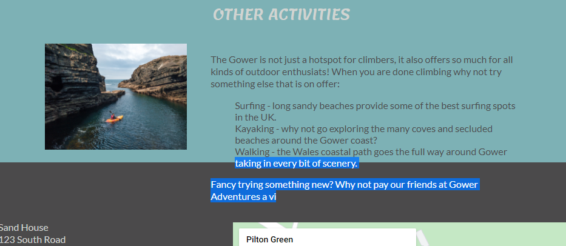
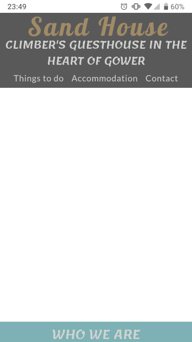
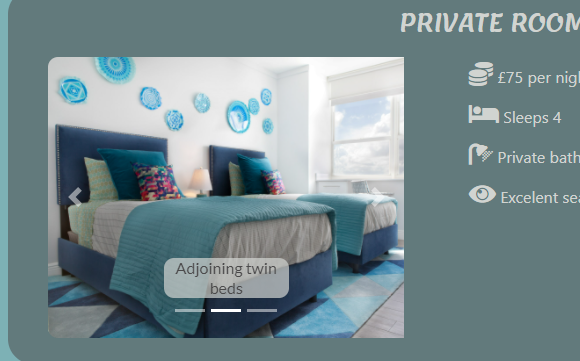
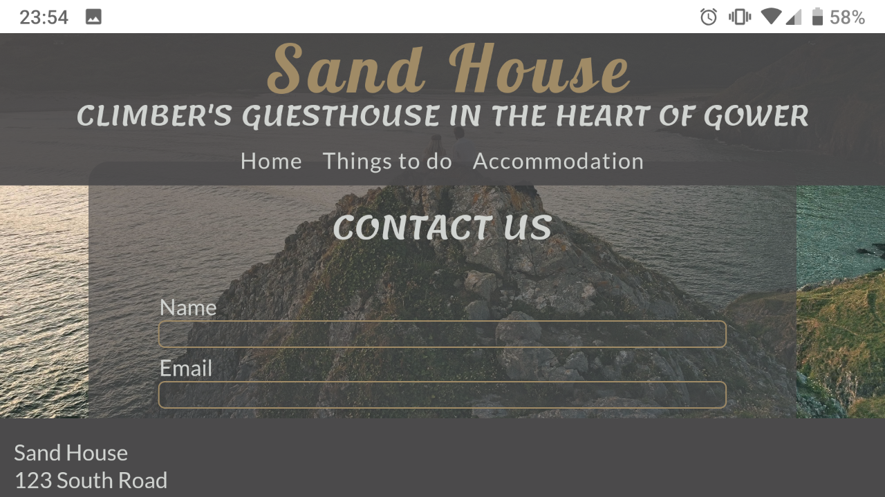
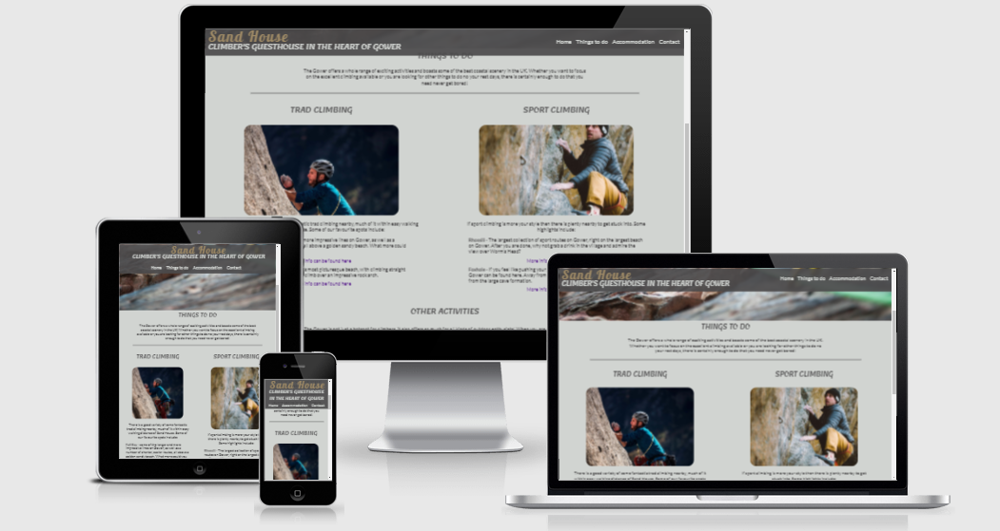
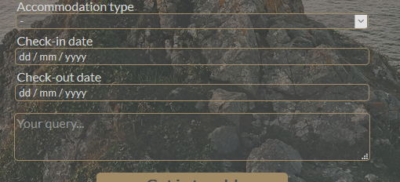
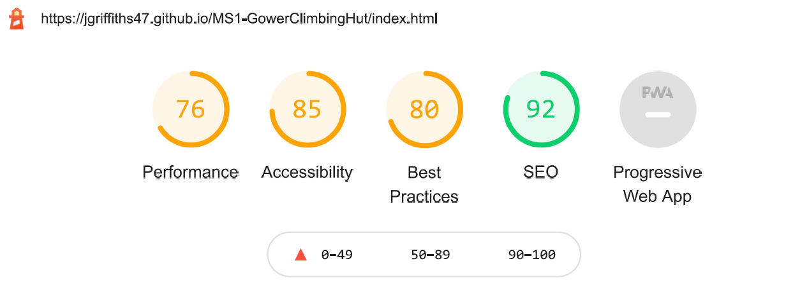
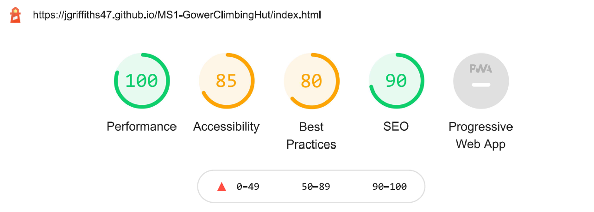
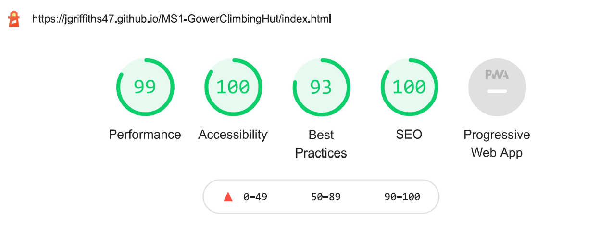
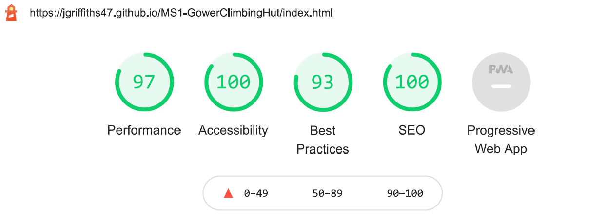

# Sand House - Gower Climbing Hut - Testing

## Site Features

In each instance of testing I tested whether the below features worked as intended:  

### Header

- Do all navigation links work correctly?
    - The links navigate to the correct pages as expected
- Does the icon work correctly as a navigation link to the home page?
    - Clicking the icon returns the user to the home page
- (Desktop only) Do the navigation links change colour when the cursor is hovered over them
    - The navigation links change colour

### Footer

- Do the social media links work correctly?
    - The links navigate to the expected social media page and open on a new tab.
- (Desktop only) Do the social media icons change colour when the cursor is hovered over them?
    - The social media links change colour.
- Does the Google Map work as intended?
    - The map opens at the correct location in a different tab when clicked.

### index.html

- Does the hero image display keyframe animation?
    - The hero image displayed the zoom effect across all devices
- Do the links to the relevant pages work correctly?
    - The links navigate to the expected pages.
- (Desktop only) Do the link images grow when the cursor is hovered over them?
    - The link images grow in size when hovered over.

### activities.html

- Do the external links work correctly?
    - The 5 external links in the main part of this page navigate to the expected sites and open in a new tab.

### accommodation.html

- Do the image carousels work as expected?
    - The user is able to use the carousel arrows/selector/touchscreen motions (mobile only) to navigate through the various images.

### contact.html

- Does the form work as expected?
    - The user is able to input data into each of the fields.
    - The email field will not accept an email address that does not contain '@'
    - The form will not submit without both 'Name' and 'Email' fields being completed (these are the only two compulsory fields)
    - The form is able to be submitted and returns a confirmation message from CI Codedump.
- (Desktop only) Do the input borders change colour when the cursor is moved over them?
    - The border colour changes to white for all ```<input>``` elements (including the submit button), the ```<textarea>``` element and the ```<select>``` element.

## User Story Testing

We can revisit the User Stories to see if the site meets the needs of the user:

"As a customer I want "
- an intuitive site that allows me to find all the information I need.
    - The site has a structured layout that is easy to navigate. All information is grouped onto the appropriate page and navigation links are always visible to the user.
- a site that works well on mobile devices so that I can browse on the go.
    - The site is responsive and elements adapt to suit the screen size it is viewed on. This is explored further in the responsiveness section of this document.
- pictures of the accommodation so that I know exactly what it is like.
    - Several pictures are provided in image carousels on the accommodation page.
- details of all the facilities that will be available for me to use.
    - Facilities are listed on the accommodation page.
- clear information about prices so that I know exactly what it will cost.
    - Prices are clearly listed next to each accommodation type.
- details on policies and rules so that I know what is expected of me before and during my stay.
    - Policies are listed clearly at the top of the accommodation page.
- a contact form so that any questions I have can be answered.
    - There is a contact form on the final page of the site.
- a contact number so that I can always get in touch quickly and easily.
    - Phone number is provided along with postal address and email address in the footer.
- a map so that I can find the accommodation easily.
    - An embedded Google Map is provided in the footer.

***

## Bugs

During the development process a number of bugs arose which needed to be addressed:

- The contact form on contact.html is completely unresponsive - the user is unable to select any of the input elements. When coding out the link to the CSS stylesheet the form works as expected. I adjusted z-index values to ensure that the form was sat on top of any other elements but that did not solve the problem. 
    - Fixed by removing form container from within splash image container - as positioned absolute will make very little difference  
     
    - Removed:
    ```
    <section>
        <div id="contact-splash">
            <div id="form-container">
                <h3>Contact Us</h3> 
                <form action="https://formdump.codeinstitute.net" method="post">
                ...
                </form>
            </div>
        </div>
    </section>
    ```

    - And replaced with: 

    ```  
    <section>
        <div id="contact-splash">
        </div>
        <div id="form-container">
            <h3>Contact Us</h3> 
            <form action="https://formdump.codeinstitute.net" method="post">
            ...
            </form>
        </div>
    </section>
    ```

- The text in the other activities section in activities.html extends past the bottom of its parent container when the viewport is narrowed and as such pushes elements in the footer out of alignment 

    <div align="center">
        
    </div>  

    - Identified that the problem was with using ```float``` property with ```display: inline-block;```. Removed the ```float``` property and used ```text-align``` and ```margin``` properties to position the text correctly 
  
    - Initial code  
  
    ```
    #other-activities-text {
        width: 65%;
        display: inline-block;
        float: right;
    }
    ```  
  
    - replaced with:  
    ```
    #other-activities-text {
        width: 65%;
        display: inline-block;
        vertical-align: top;
    }

    #other-activities-text p,
    #other-activities-text ul {
        text-align: left;
    }
    ```
    - (NB: It was later decided to remove the image entirely and align the text to the centre of the page)  

- Hero image on index.html not showing when viewed on mobile device. This was a bug that only became apparent when viewing the site on my mobile device - this was not showing on Chrome DevTools

    <div align="center">
        
    </div>  

    - This was solved by including a lower resolution image to be targeted by media queries and loaded on mobile devices. The image now loads correctly on mobile devices.

- Rounded corners on carousel images are being cut off when screen width narrows.

    <div align="center">
        
    </div>  
    
    - Fixed by also including border radius on parent ```.carousel-inner``` divs to effectively round the corners on the viewable window. Border radius remained on `````` elements so that images smaller than the carousel window still retain their rounded corners.

- Contact form extends off screen when viewed in landscape mode on mobile devices.

    <div align="center">
        
    </div>  

    - Fixed by replacing vh units in ```height``` property of the splash image with pixels to ensure that it is always large enough to extend past the contact form.

***

## Responsiveness

All pages are responsive to different viewport sizes and media queries have been used to establish breakpoints at widths of 1250px (for tablet view) and 720px (for mobile view).

To illustrate how the site looks across different devices I used [Am I Responsive](http://ami.responsivedesign.is/):

<div align="center">
    
</div>  

The responsive aspects of the site were tested across a range of device widths and are:

### Tablet View

#### Header

- Navigation bar moves below the logo
- Both the logo and the navigation bar become aligned centrally

#### Footer

- Retains same style as desktop view as elements are narrow enough to not be affected right down to the mobile view breakpoint.

#### index.html

- Link to contact page shifts to below the links to activities and accommodation and is aligned centrally
- The text of the reviews sits below the profile pictures and both are aligned centrally within the review div

#### activities.html

- Width of intro and other activities sections increase from 60% to 80% of screen width for improved legibility

#### accommodation.html

- Width of intro section increase from 60% to 80% of screen width for improved legibility

#### contact.html

- Form expands from 30% to 60% of screen width to be more user-friendly on smaller screens

### Mobile View

#### Header

- Font size of sub-heading reduces
- The link to the current page is removed from the nav bar so as to save space in the small area. This works across all pages of the site and will only display links for the other three pages.

#### Footer

- Text, social links and copyright becomes centrally aligned
- Map shifts to below social links
- Map takes up full width of screen for maximum viewability

#### index.html

- A lower resolution hero image is loaded for improved performance.
- Hero image has been cropped to keep focus on the climber.
- Page links are aligned vertically, take up 90% of the screen width and are aligned centrally on the page.
- Reviews take up 80% of the screen width, are stacked one on top of the other and are aligned centrally to the page

#### activities.html

- Lower resolution splash image is loaded for improved performance.
- Climbing info and other activities sections are aligned vertically, take up 90% of the screen width and are aligned centrally to the page.

#### accommodation.html

- Room info lists sits underneath image carousel. Text is aligned centrally
- Image carousel takes up full width of parent container for improved legibility
- Image captions removed so as not to obscure image. (This is a Bootstrap feature and is activated at 767px and less)

#### contact.html

- Form expands further from 60% to 80% of screen width to be more user-friendly on even smaller screens

***

## Browser Compatibility

The project was built and tested on [Google Chrome](https://www.google.com/intl/en_uk/chrome/) for Windows (Version 90.0.4430.93). All features described elsewhere in this document function well on this browser.

### Other Browsers Tested:

[Microsoft Edge](https://www.microsoft.com/en-us/edge) (Version 90.0.818.51)
- No issues - all functions as expected

[Mozilla Firefox](https://www.mozilla.org/en-GB/firefox/) (Version 88.0)
- Drop-down arrow for the ```<select>``` element is not picking up the ```background-color``` value making it look out of place. Do not seem able to change this.
- Placeholder text on contact form has an in-built opacity level that cannot be overwritten and that makes the placeholder text less legible than on other browsers, although it still retains enough contrast so I don't believe it is worth addressing at this stage. Inputted text is not affected.
- All other parts of the site function as expected.

    <div align="center">
        
    </div>  

[Google Chrome for Android](https://play.google.com/store/apps/details?id=com.android.chrome&hl=en_GB&gl=US) (Version 90.0.4430.91)
- No issues - all functions as expected (tested mobile view only).

***

## Lighthouse Audit

I audited my site using [Lighthouse](https://developers.google.com/web/tools/lighthouse) in Chrome DevTools to rate the site for performance, accessibility, best practices and search engine optimisation (SEO). The initial report gave scores of:

<span align="left">
    
</span>  

<span align="right">
    
</span>  

(First set of scores are for mobile devices and second set of scores are for desktop devices)  
  
Full reports can be found [here](readme-assets/lighthouse/) but a summary of the recommendations and my response is below:

|Recommendation|Response|
|---|---|
|"Background and foreground colors do not have a sufficient contrast ratio."|Changed background colour throughout site to #d1d4d1 to provide better contrast|
|```<frame>``` or ```<iframe>``` elements do not have a title|Added title to Google Maps iFrame in footer|
|Links do not have a discernible name|Added titles to social media links in footer|
|Links to cross-origin destinations are unsafe|Added ```rel="noopener"``` to all external links|
|Displays images with incorrect aspect ratio|Related to review-profile-f.jpg (image displayed is 1:1, actual ratio is 1:1.06). Replaced image with 1:1 version|
|Document does not have a meta description|Added meta description as well as keywords and author|
|Properly size images|Compressed image files for better performance|

These changes resulted in improved scores of

<span align="left">
    
</span>  

<span align="right">
    
</span>  

(First set of scores are for mobile devices and second set of scores are for desktop devices)  

***

## Code Validation

### HTML
Validated using [W3C HTML Validator](https://validator.w3.org/nu/?doc=https%3A%2F%2Fjgriffiths47.github.io%2FMS1-GowerClimbingHut%2Findex.html). The final code passes without any errors.  
  
Initial validation highlighted some errors which needed correction:
- Inappropriate use of ```<span>``` element when a block element would be most suitable. Replaced these instances with ```<div>```.
- Use of ```<div>``` with a background image as a child of ```<a>```. Replaced with ``````.
- `````` elements without ```alt``` attribute. Used ```alt=""``` as images were primarily to break up the space and provide visual structure.
- Review section was without heading. Added ```<h3>``` but made it hidden to visual users, but not to screen readers. This would help accessibility.

### CSS
Validated using [Jigsaw CSS Validator](https://jigsaw.w3.org/css-validator/validator?uri=https%3A%2F%2Fjgriffiths47.github.io%2FMS1-GowerClimbingHut%2Findex.html&profile=css3svg&usermedium=all&warning=1&vextwarning=&lang=en). The final code passes without any errors.  
  
There are some warnings about my style.css being highlighted by the validator:
> #contact-submit	Same color for background-color and border-top-color

This styling was a deliberate choice. It meant that there is no visible border but when it was hovered over and a white border appears the element doesn't grow in size and push the bottom of the form down.
